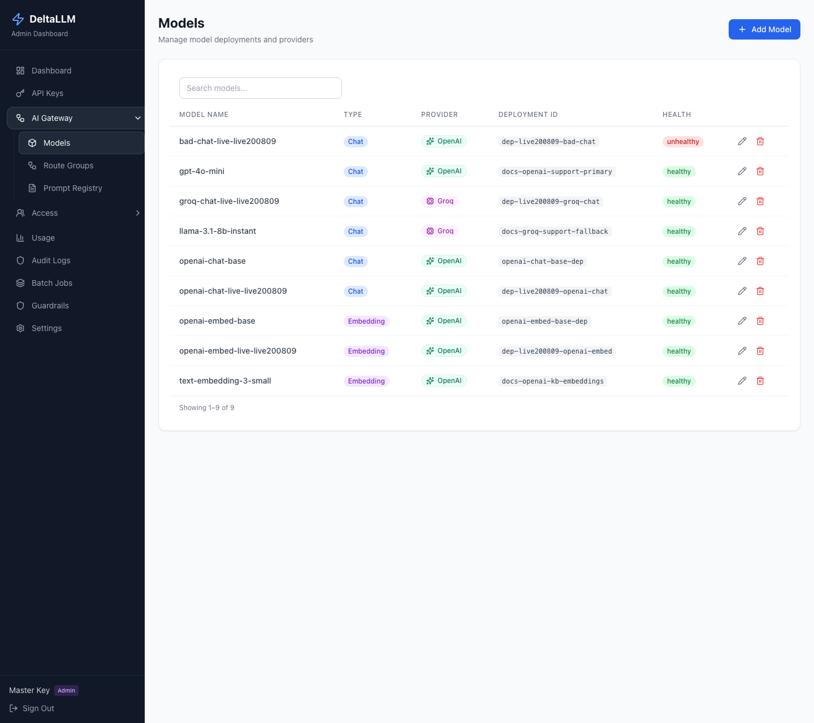

[](https://github.com/deltawi/deltallm/actions/workflows/ci.yml)
[](https://deltallm.readthedocs.io/en/latest)
[](https://github.com/deltawi/deltallm/releases)
[](https://www.python.org/downloads/)
[](LICENSE)
[](https://github.com/deltawi/deltallm/commits/main)
[](https://github.com/deltawi/deltallm/stargazers)

[](https://railway.com/deploy/deltallm?utm_medium=integration&utm_source=template&utm_campaign=deltallm)

# DeltaLLM

DeltaLLM is a self-hosted LLM gateway. Point OpenAI-compatible clients at one endpoint, then manage model deployments, routing, scoped API keys, budgets, guardrails, MCP tools, and usage from one control plane.

## One Endpoint For Your Apps

```python
from openai import OpenAI

# Before: call OpenAI directly.
client = OpenAI(api_key="sk-...")

# After: send the same OpenAI-compatible requests through DeltaLLM.
client = OpenAI(
    base_url="http://localhost:4002/v1",
    api_key="sk-deltallm-key",
)
```

Your application keeps its OpenAI request format. DeltaLLM handles provider credentials, routing, policy checks, caching, failover, and spend tracking.

## What It Handles

- **Unified API** - Use one OpenAI-compatible endpoint across OpenAI, Anthropic, Azure OpenAI, Bedrock, Gemini, Groq, and other providers.
- **Scoped API keys** - Issue virtual keys with model allowlists, rate limits, budgets, owners, and expiry.
- **Routing and failover** - Route by strategy, retry failed deployments, and separate provider credentials from application code.
- **Batch API** - Run embeddings and non-streaming chat completions asynchronously through OpenAI-compatible files and batches, even when upstream providers are synchronous.
- **MCP gateway** - Register external MCP servers and expose approved tools through controlled gateway flows.
- **Guardrails** - Detect PII and prompt injection before provider calls.
- **Spend and usage** - Attribute cost by key, team, organization, model, and provider.
- **Admin UI** - Manage models, credentials, route groups, teams, users, usage, audit logs, and settings in the browser.
- **Operations** - Export Prometheus metrics, request logs, audit events, cache behavior, and health checks.

## Admin UI



The UI is the control plane for model deployments, route groups, API keys, access, usage, guardrails, audit logs, and runtime settings.

## Quick Start With Docker

Use Docker Compose for the shortest local evaluation path. It starts DeltaLLM, PostgreSQL, and Redis.

```bash
git clone https://github.com/deltawi/deltallm.git
cd deltallm
cp config.example.yaml config.yaml
```

For a first local request, enable one-time model bootstrap in `config.yaml`:

```yaml
general_settings:
  model_deployment_source: db_only
  model_deployment_bootstrap_from_config: true
```

Generate the required secrets:

```bash
python3 -c 'import secrets; print("DELTALLM_MASTER_KEY=sk-" + secrets.token_hex(20) + "A1")'
python3 -c 'import secrets; print("DELTALLM_SALT_KEY=" + secrets.token_hex(32))'
```

Create `.env` with the generated values and a provider key:

```env
DELTALLM_MASTER_KEY=sk-your-generated-master-key
DELTALLM_SALT_KEY=your-generated-salt-key
OPENAI_API_KEY=sk-your-openai-key
PLATFORM_BOOTSTRAP_ADMIN_EMAIL=admin@example.com
PLATFORM_BOOTSTRAP_ADMIN_PASSWORD=ChangeMe123!
```

Start the stack:

```bash
docker compose --profile single up -d --build
```

Check health and send a request:

```bash
curl http://localhost:4002/health/liveliness

curl http://localhost:4002/v1/chat/completions \
  -H "Authorization: Bearer $DELTALLM_MASTER_KEY" \
  -H "Content-Type: application/json" \
  -d '{
    "model": "gpt-4o-mini",
    "messages": [
      {"role": "user", "content": "Hello from DeltaLLM"}
    ]
  }'
```

Open the Admin UI at `http://localhost:4002`.

Full Docker setup, environment variables, HA Compose, and Dockerfile usage are covered in the [Docker guide](docs/getting-started/docker.md).

## Deployment Paths

| Path | Use it for | Start here |
| --- | --- | --- |
| Railway | Managed evaluation with hosted PostgreSQL and Redis | [Railway deployment](docs/deployment/railway.md) |
| Docker Compose | Local evaluation, demos, small teams, simple self-hosting | [Docker guide](docs/getting-started/docker.md) |
| Kubernetes | Multi-instance production, ingress, autoscaling, and managed infrastructure | [Kubernetes guide](docs/deployment/kubernetes.md) |
| Local development | Backend, UI, and contributor workflow from the repository | [Installation guide](docs/getting-started/installation.md) |

## Documentation

- [Getting started](docs/getting-started/index.md)
- [Gateway usage examples](docs/getting-started/quickstart.md)
- [Configuration reference](docs/configuration/index.md)
- [Model deployments](docs/configuration/models.md)
- [Features](docs/features/index.md)
- [Admin UI guide](docs/admin-ui/index.md)
- [API reference](docs/api/index.md)
- [Deployment guide](docs/deployment/index.md)

## Contributing

- [Report issues](https://github.com/deltawi/deltallm/issues)
- [Request features](https://github.com/deltawi/deltallm/discussions)
- PRs are welcome. Start with the [local installation guide](docs/getting-started/installation.md).

## License

See [LICENSE](LICENSE).
