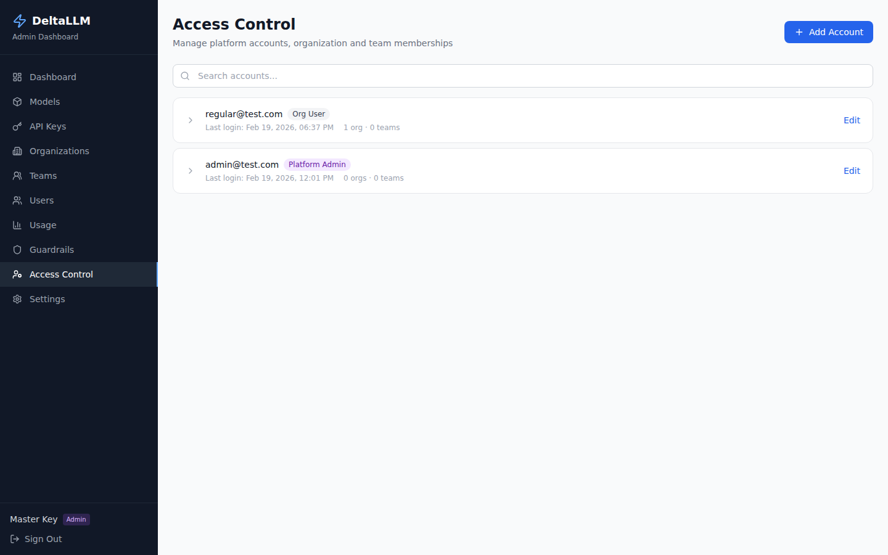

# Access Control

The Access Control page (platform admins only) manages platform accounts and role assignments across organizations and teams.

## Platform Accounts

Manage the accounts that can log into the admin UI.

### Account Fields

| Field | Description |
|-------|-------------|
| Email | Account email address |
| Role | `platform_admin` or `org_user` |
| Active | Whether the account can log in |
| Force Password Change | Require password change on next login |
| MFA Enabled | Whether multi-factor authentication is active |

### Creating an Account

Create new accounts with an initial password. The user can change their password on first login if `force_password_change` is set.

## Organization Memberships

Assign accounts to organizations with specific roles:

| Role | Description |
|------|-------------|
| `org_owner` | Full org management (includes audit log access via `Permission.AUDIT_READ`) |
| `org_admin` | Manage teams, keys, and users (includes audit log access via `Permission.AUDIT_READ`) |
| `org_billing` | View spend and key data (no audit log access) |
| `org_auditor` | Read-only access (keys/users); no audit log access |
| `org_member` | Basic membership |

## Team Memberships

Assign accounts to teams with specific roles:

| Role | Description |
|------|-------------|
| `team_admin` | Manage team members and keys |
| `team_developer` | Create and use API keys |
| `team_viewer` | Read-only access |

## How RBAC Affects the UI

When an `org_user` logs in, the UI automatically filters:

- **Organizations** — Only shows orgs they are members of
- **Teams** — Only shows teams within their assigned orgs
- **API Keys** — Only shows keys belonging to accessible teams
- **Users** — Only shows users within accessible teams
- **Navigation** — Hides Guardrails, Settings, and Access Control pages
- **Audit Log** — Visible only to `platform_admin`, `org_owner`, and `org_admin` (gated by `Permission.AUDIT_READ`)
