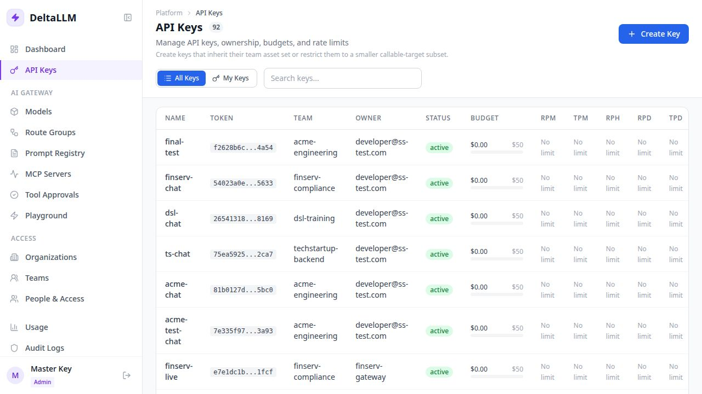

# API Keys

The API Keys page is where operators issue credentials for applications, teams, and controlled integrations.

## What this page is for

- Create a new key for a team or user
- Limit which models or route groups a key can call
- Apply budgets and RPM/TPM rate limits
- Regenerate or revoke keys without changing the integration pattern

## Key fields

- **Key name**: human-readable label shown in the table
- **Team**: ownership boundary for spend, permissions, and reporting
- **Models**: optional allowlist of deployments or route groups
- **Max budget**: hard spend ceiling for that key
- **RPM / TPM**: request and token throttles

## Important behavior

- The raw key is shown once at creation time
- The table keeps the hashed token, status, budget progress, and allowlist
- Scoped access still applies: org users only see keys inside their organizations
