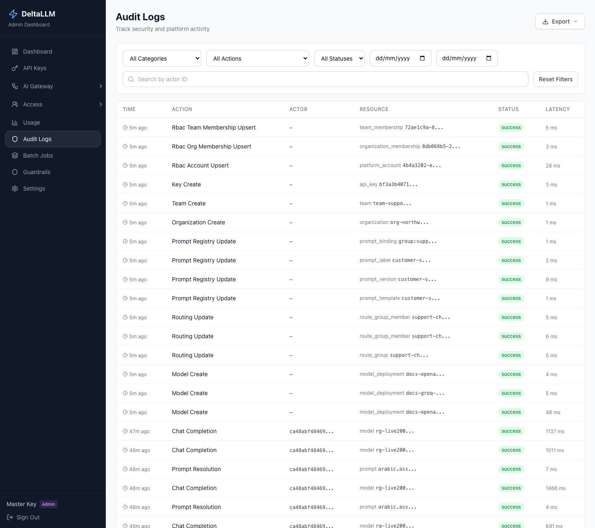

# Audit Logs

Audit Logs are the operator-facing record of control-plane and data-plane activity.

## What this page covers

- Administrative changes such as model, route-group, prompt, key, and membership updates
- Authentication events
- Request-level operational traces when audit capture is enabled

## Main workflows

- Filter by category, action, status, actor, request ID, and date range
- Open an event to inspect metadata, payload snapshots, and request tracking fields
- Follow a request or correlation ID through the event timeline
- Export filtered results for external review

## Notes

- Payload visibility depends on audit retention and redaction settings
- The detail drawer is the main place to inspect actor, resource, and payload context
