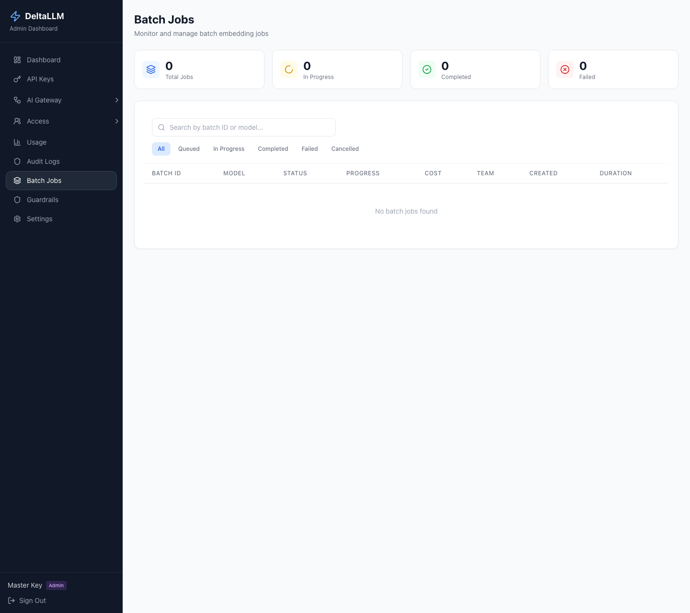

# Batch Jobs

Batch Jobs is the operations view for long-running asynchronous work.

Today, the public batch API is focused on embeddings batches, and this page helps operators inspect job progress, failures, and cost after submission.

## Quick Success Workflow

1. Submit a batch through the API
2. Open **Operations > Batch Jobs**
3. Filter by status or search by batch ID
4. Open the batch detail to inspect progress and failures
5. Cancel the batch if needed

## What This Page Shows

- queue summary counts
- status-based filtering
- per-batch progress
- total and failed item counts
- team ownership
- estimated or accumulated cost
- timestamps for creation, start, and completion

## When To Use It

Use this page when work is not request-response interactive and you need:

- visibility into queued or running jobs
- failure review at the item level
- cancellation controls
- operational reporting after a batch finishes

## Related API Surface

The admin backend exposes endpoints for:

- batch summary
- batch list
- batch detail with items
- batch cancellation

The public data-plane API also exposes:

- `/v1/files`
- `/v1/batches`

See [Proxy Endpoints](../api/proxy.md) and [Admin Endpoints](../api/admin.md) for the API reference.

## Related Pages

- [Proxy Endpoints](../api/proxy.md)
- [Admin Endpoints](../api/admin.md)
