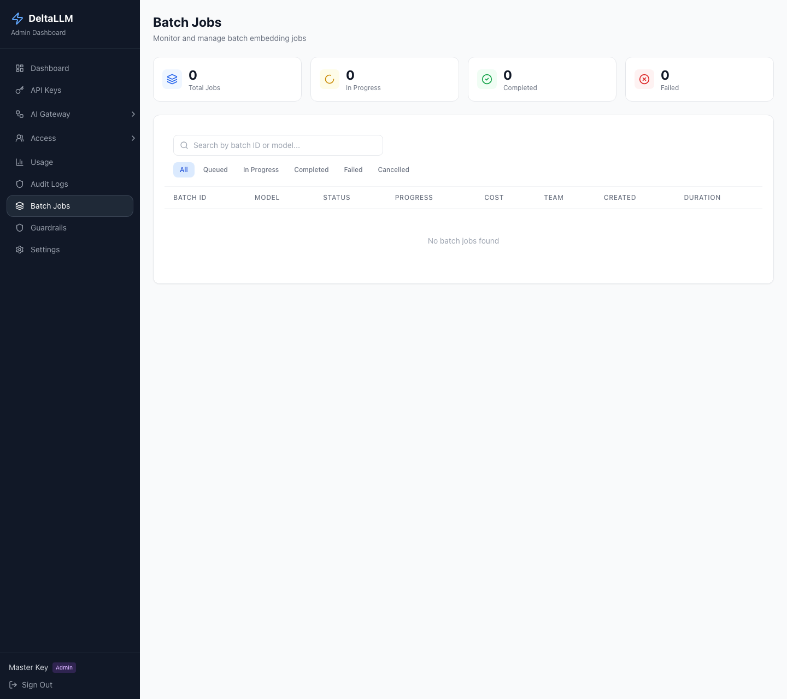

# Batch Jobs

Batch Jobs is the operations view for long-running asynchronous work.

The public batch API supports embeddings and non-streaming chat completion batches. This page helps operators inspect job progress, failures, and cost after submission.

## Quick Success Workflow

1. Submit a batch through the API
2. Open **Operations > Batch Jobs**
3. Filter by status or search by batch ID
4. Open the batch detail to inspect progress and failures
5. Cancel the batch if needed

## What This Page Shows

- queue summary counts
- status-based filtering
- per-batch progress
- total and failed item counts
- team ownership
- estimated or accumulated cost
- timestamps for creation, start, and completion
- redacted terminal webhook delivery status, attempts, status class, and bounded failure reason
- a replay action for failed webhook deliveries when the operator has batch update permission
- an archived delivery-only view when ordinary batch metadata has already been cleaned up

## When To Use It

Use this page when work is not request-response interactive and you need:

- visibility into queued or running jobs
- failure review at the item level
- cancellation controls
- operational reporting after a batch finishes
- inspection or replay of a failed terminal webhook without exposing customer delivery material

If a known batch ID no longer has retained job metadata, opening its detail route automatically checks for separately retained webhook delivery state. The page clearly identifies this archived state and shows only redacted delivery fields and permitted replay controls; job items, cost, cancellation, destination, headers, payload, and signing material are unavailable.

After **Replay delivery** succeeds, the page immediately shows the delivery as queued and refreshes only the webhook delivery state. If that follow-up refresh fails, a warning explains that the replay was scheduled but the newest status could not be loaded. The warning does not mean the replay failed; refresh the page to inspect its current state.

## Related API Surface

The admin backend exposes endpoints for:

- batch summary
- batch list
- batch detail with items
- batch cancellation
- redacted webhook delivery inspection
- failed-only webhook replay

The public data-plane API also exposes:

- `/v1/files`
- `/v1/batches`

See [Proxy Endpoints](../api/proxy.md) and [Admin Endpoints](../api/admin.md) for the API reference.

## Related Pages

- [Proxy Endpoints](../api/proxy.md)
- [Admin Endpoints](../api/admin.md)
