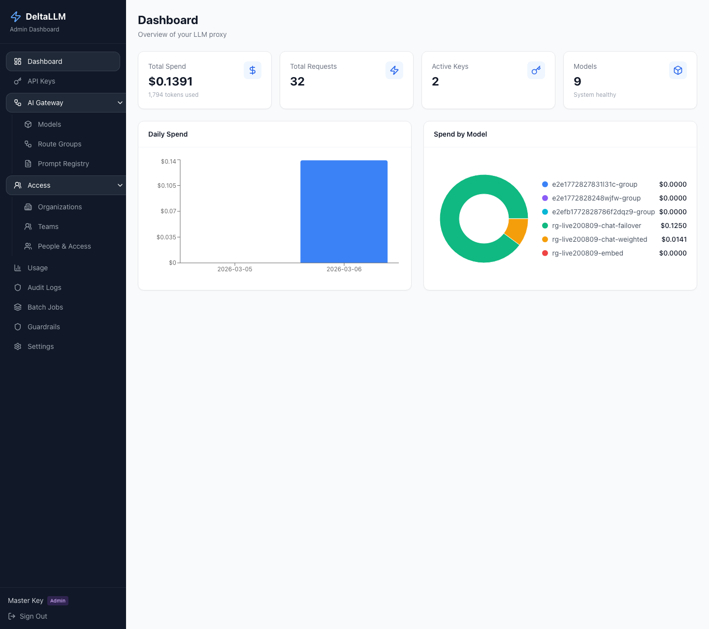

# Dashboard

The Dashboard is the landing page for quick operational awareness.

**Access:** platform admin or a role with `spend.read`. Dashboard totals follow the server's
authorized spend scope. See [Access requirements](access-requirements.md) and the [Spend admin
API](../api/admin.md#spend).

## What it summarizes

- Total spend
- Total requests
- Total processed tokens
- Active model count

## Main widgets

- **Top cards** show the current high-level totals
- **Daily spend trend** helps spot spikes or regressions
- **Usage breakdowns** show which models or groups are carrying traffic

## When to use it

Start here when you need a health and spend snapshot before drilling into models, route groups, usage, or audit history.
