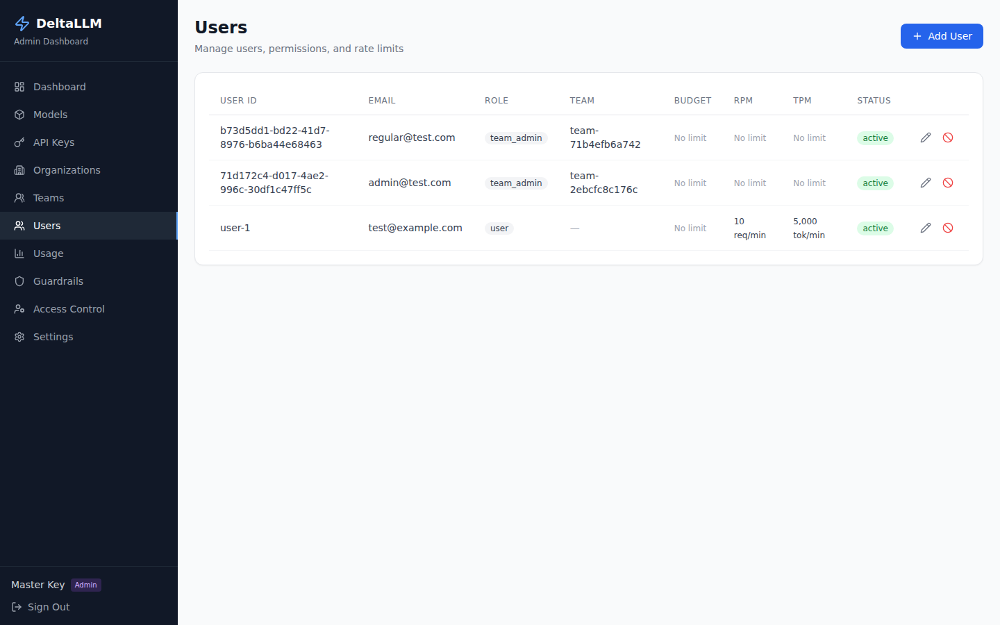
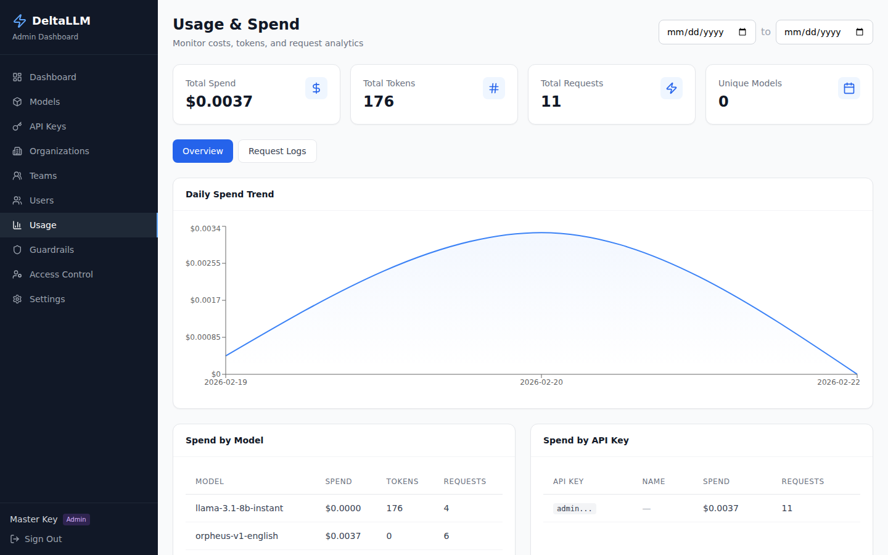
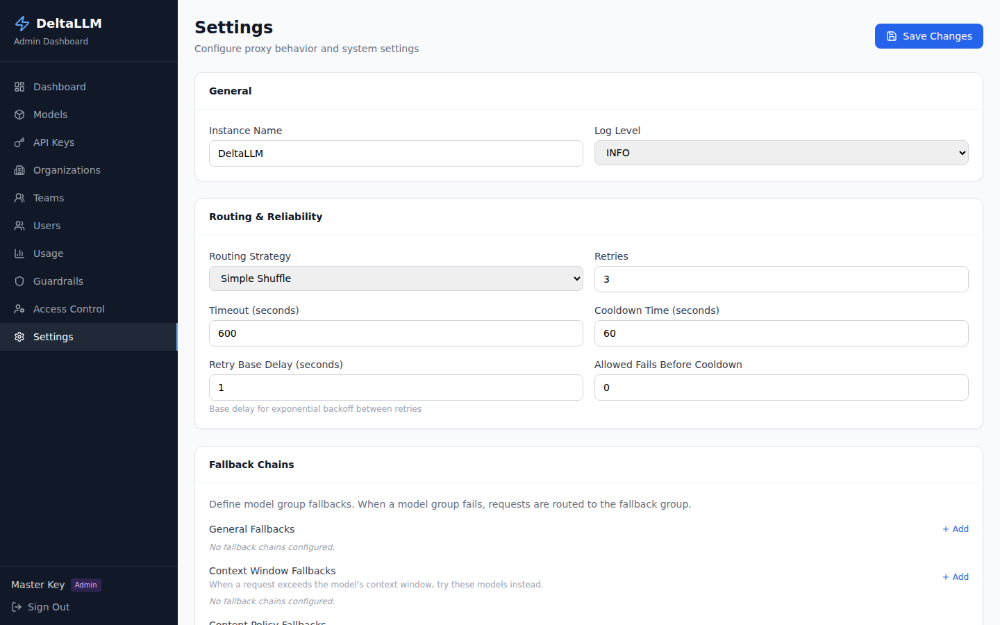

# Admin UI

DeltaLLM includes a full-featured web dashboard for managing the gateway. The admin UI is built with React and communicates with the backend through the admin API.

## Accessing the UI

- **Development**: `http://localhost:5000` (Vite dev server)
- **Production**: Same URL as the API (backend serves the built frontend)

## Authentication

The admin UI supports two login methods:

- **Email Login**: Session-based authentication with email and password
- **Master Key**: Direct authentication with the master API key

When SSO is configured, a third tab appears for single sign-on.

## Pages Overview

| Page | Description | Access |
|------|-------------|--------|
| [Dashboard](dashboard.md) | Overview stats and charts | All authenticated users |
| [Models](models.md) | Model deployment management | All authenticated users |
| [API Keys](keys.md) | Virtual key management | Scoped by role |
| [Organizations & Teams](orgs-teams.md) | Org and team management | Scoped by role |
| Users | User management | Scoped by role |
| Usage | Spend analytics and request logs | All authenticated users |
| [Guardrails](../features/guardrails.md) | Content safety configuration | Platform admins only |
| [Access Control](access-control.md) | RBAC account and membership management | Platform admins only |
| Settings | Gateway configuration | Platform admins (write), all (read) |

## Users

Manage users, their permissions, team assignments, and rate limits.

## Usage & Spend

Monitor costs, tokens, and request analytics with daily trends and per-model/key breakdowns.

## Settings

Configure routing strategy, caching, health checks, retry policies, and fallback chains.

## Role-Based Visibility

The sidebar navigation adapts based on the user's role:

- **Platform admins** see all pages including Guardrails, Settings, and Access Control
- **Organization users** see Dashboard, Models, Keys, Orgs, Teams, Users, and Usage — but scoped to their assigned organizations
