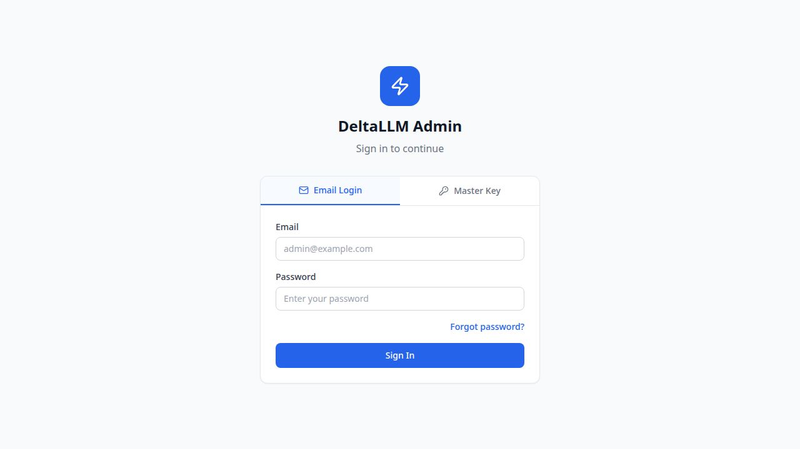

# Admin UI

The DeltaLLM admin UI is the control plane for model deployments, route groups, prompt rollout, access management, and runtime operations.

## Access and authentication

- **Development**: `http://localhost:5000`
- **Single-port / Docker**: `http://localhost:4002`
- **Email login** uses the platform account directory and session cookies
- **Master key login** gives platform-admin access for local operations
- **SSO** appears automatically when an identity provider is configured

## Navigation model

The current UI is organized by operator intent:

- **Dashboard**: health and spend overview
- **API Keys**: credential issuance and limits
- **AI Gateway**: [Models](models.md), [Route Groups](route-groups.md), [Prompt Registry](prompt-registry.md), and [MCP Servers](mcp.md)
- **Access**: [Organizations](organizations.md), [Teams](teams.md), and [People & Access](people-and-access.md)
- **Operations**: [Usage & Spend](usage.md), [Audit Logs](audit-logs.md), [Batch Jobs](batch-jobs.md), [Guardrails](guardrails.md), and [Settings](settings.md)

Parent menu sections start collapsed by default and expand only when the operator chooses them.

## Role-based visibility

- **Platform admins** can access the full UI
- **Organization users** see only the organizations, teams, keys, and users they are allowed to manage
- **Audit logs** require audit-read access
- **Guardrails**, **Prompt Registry**, **Route Groups**, **MCP Servers**, and **Settings** are admin surfaces

## Page guide

| Area | Purpose |
| --- | --- |
| [Dashboard](dashboard.md) | Spend, request, and model activity overview |
| [Models](models.md) | Provider-backed deployments and health |
| [Route Groups](route-groups.md) | Group-level routing, membership, prompt binding, and usage |
| [Prompt Registry](prompt-registry.md) | Prompt shells, versions, labels, tests, and history |
| [MCP Servers](mcp.md) | External MCP server registry, bindings, tool policies, approvals, and health |
| [API Keys](api-keys.md) | Key issuance, ownership, budgets, and rate limits |
| [Organizations](organizations.md) | Top-level ownership, budgets, and limits |
| [Teams](teams.md) | Team-level budgets, memberships, and operating scope |
| [People & Access](people-and-access.md) | Platform accounts plus org and team memberships |
| [Usage & Spend](usage.md) | Trends, breakdowns, and request logs |
| [Audit Logs](audit-logs.md) | Control-plane and data-plane audit history |
| [Batch Jobs](batch-jobs.md) | Batch processing status and progress |
| [Guardrails](guardrails.md) | Safety policy definitions and scoped assignment |
| [Settings](settings.md) | Global runtime, fallback, and cache behavior |

Runtime visibility for models and route groups is governed through callable-target bindings and scope policies. In the UI, organizations choose the allowed top-level asset set, teams and keys can inherit that set or narrow it further in their create/edit dialogs, and People & Access can narrow specific runtime users when required.
