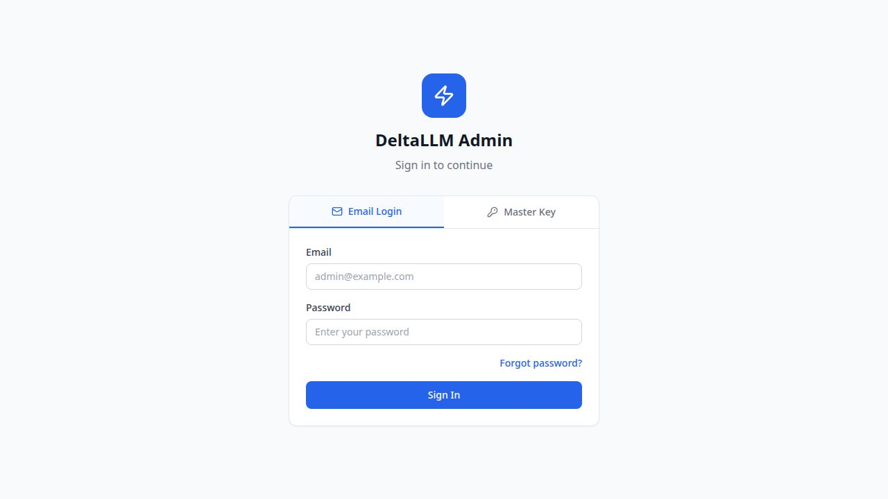

# Administer DeltaLLM

The Admin UI is where you manage models, access, spending, safety rules, and day-to-day activity.

## Open the Admin UI

- Docker quickstart: `http://localhost:4002`
- Local development: `http://localhost:5000`

You can sign in with an administrator email and password, a configured SSO provider, or the master
key during local setup. What you can see and change depends on your role. Read [Sign in and get
access](access-requirements.md) if a page or action is missing.

## Find the right area

| Area | What you do there |
| --- | --- |
| [Sign-in and access](access-requirements.md) | Resolve missing pages or blocked actions |
| [Dashboard](dashboard.md) | Check requests, spending, and model activity |
| [Models](../guides/admin-models.md) | Connect provider-backed models |
| [Provider credentials](../guides/admin-provider-credentials.md) | Reuse and rotate provider secrets |
| [Route groups](../guides/admin-route-groups.md) | Control routing and failover across models |
| [Prompts](prompt-registry.md) | Manage reusable, versioned prompts |
| [MCP servers](mcp.md) | Connect external tools |
| [API keys](api-keys.md) | Give applications controlled access |
| [Organizations](organizations.md) and [teams](teams.md) | Set ownership, budgets, and limits |
| [People and permissions](people-and-access.md) | Manage user access |
| [Plans and tiers](../guides/admin-tiers.md) | Reuse model access, pricing, and limits across organizations |
| [Usage and spending](usage.md) | Find cost and request trends |
| [Budgets](../guides/admin-budgets.md) and [rate limits](../guides/admin-rate-limits.md) | Control spending and request volume |
| [Guardrails](guardrails.md) | Check prompts and responses for risky content |
| [Audit logs](audit-logs.md) | Review important system changes |
| [Tool approvals](tool-approvals.md) | Approve or reject protected MCP tool calls |
| [Batch jobs](batch-jobs.md) | Monitor background jobs |
| [Settings](settings.md) | Change installation-wide defaults |
| [Playground](playground.md) | Test a model with a real key |

## Recommended first setup

1. Add one model and confirm that it is healthy. Enter the provider key directly for the simplest
   setup, or save a [provider credential](../guides/admin-provider-credentials.md) when several
   models will share it.
2. Create an organization and a team. Every application key belongs to a team.
3. Give the organization and team access to the model.
4. Create a key for the first application and copy it immediately.
5. Test the model in the Playground.
6. Add budgets, rate limits, routing, or guardrails as needed.

The Admin UI is not the security boundary by itself. The API checks permissions again for every
request.
