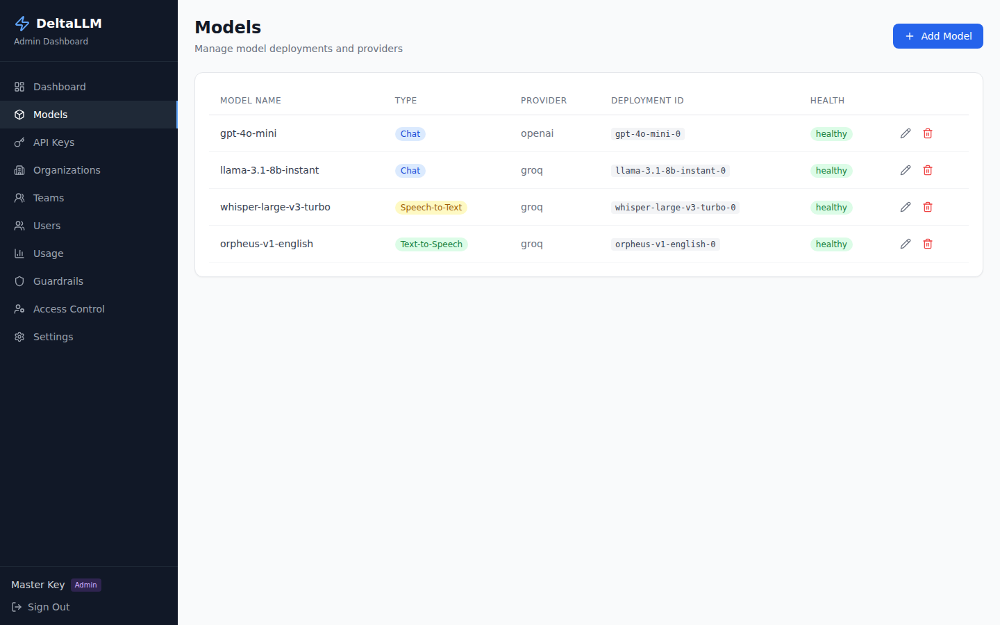

# Managing Models

The Models page lets you add, edit, and remove LLM model deployments through the web UI.

## Listing Models

The models table shows all configured deployments with:

- Deployment ID
- Model name (group name)
- Provider
- Mode (chat, embedding, image, TTS, STT, rerank)
- Health status

## Adding a Model

Click **Add Model** and fill in:

1. **Model Name** — The public name clients will use (e.g., `gpt-4o-mini`)
2. **Provider** — Select the LLM provider
3. **Model ID** — The provider-specific model identifier (e.g., `openai/gpt-4o-mini`)
4. **API Key** — Provider API key (use `os.environ/VAR_NAME` for environment variables)
5. **API Base** — Provider API base URL (optional)
6. **Mode** — Model type: chat, embedding, image_generation, audio_speech, audio_transcription, or rerank
7. **Timeout** — Request timeout in seconds

### Pricing

Set per-token pricing for accurate spend tracking:

- **Input cost per token**
- **Output cost per token**
- **Max tokens** (context window size)

### Default Parameters

Add default parameters that are injected into every request for this deployment. User-provided values always take precedence.

Common defaults:

- `temperature` — Default sampling temperature
- `max_tokens` — Default maximum output tokens
- `voice` — Default voice for TTS models
- `response_format` — Default response format

## Editing a Model

Click the edit icon on any model row to update its configuration. Changes are persisted to the database and take effect immediately without restarting the gateway.

## Deleting a Model

Click the delete icon and confirm to remove a deployment. This removes the deployment from the routing pool immediately.

## Database Persistence

Models added through the UI are stored in the database (not just in memory). They survive gateway restarts. In `db_only` mode, deployments are loaded only from the database.
