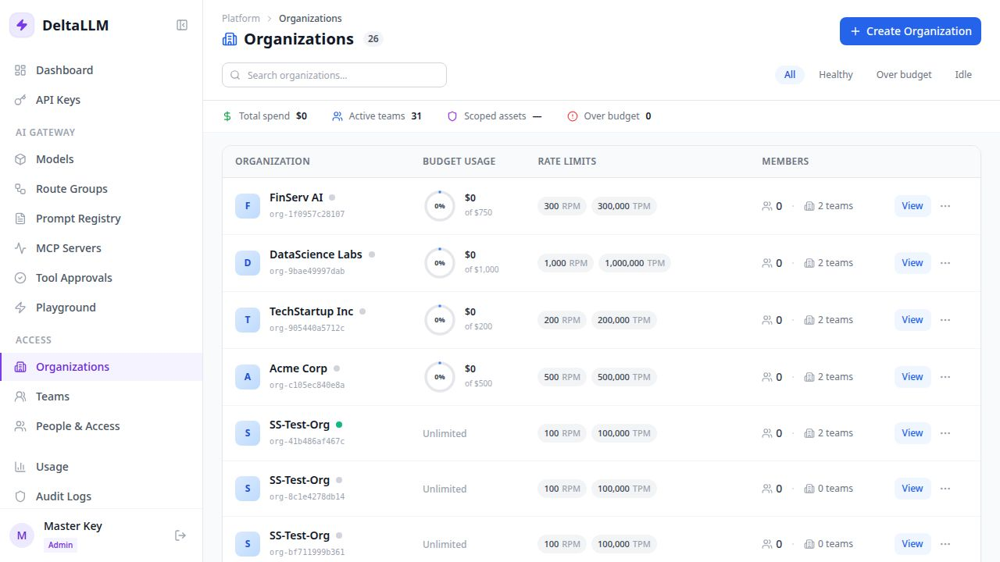

# Organizations

Organizations are the top-level tenant and budget boundary in the admin UI.

## What this page manages

- Organization identity and display name
- Top-level budgets and rate limits (RPM, TPM, RPH, RPD, TPD)
- Audit content storage behavior
- Team count and ownership context
- The tenant boundary that callable-target access and lower-scope restrictions inherit from

## Typical workflow

1. Create the organization
2. Set the broad budget and rate limits across all time windows
3. Choose which models and route groups the organization is allowed to use
4. Add teams inside the organization
5. Assign platform accounts through People & Access

## Rate limit fields

| Field | Description |
| --- | --- |
| RPM | Maximum requests per minute across all keys in the org |
| TPM | Maximum tokens per minute across all keys in the org |
| RPH | Maximum requests per hour across all keys in the org |
| RPD | Maximum requests per day across all keys in the org |
| TPD | Maximum tokens per day across all keys in the org |

All limits are optional. Only configured limits are enforced. Organization limits act as a shared cap — all teams and keys within the org contribute to the same counters.

## Why it matters

Organization scope controls how teams, keys, and access are partitioned. It is the right place for tenant-wide spending and policy boundaries.

Platform admins can bootstrap runtime model and route-group visibility directly in the create/edit dialog through the organization asset access section. Teams, keys, and users can only inherit or narrow from that organization set.
