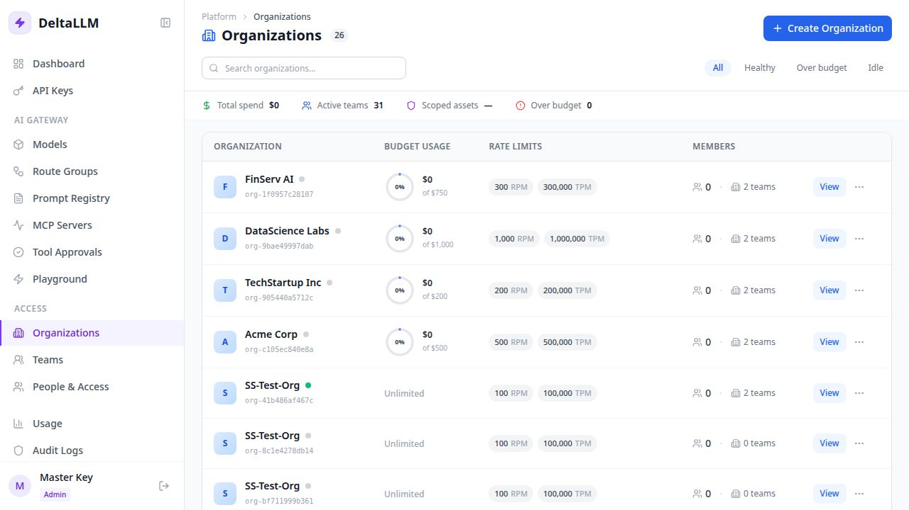

# Organizations

Organizations are the top-level tenant and budget boundary in the admin UI.

## What this page manages

- Organization identity and display name
- Top-level budgets and rate limits (RPM, TPM, RPH, RPD, TPD)
- Audit content storage behavior
- Team count and ownership context
- The tenant boundary that callable-target and access-group grants inherit from

## Typical workflow

1. Create the organization
2. Set the broad budget and rate limits across all time windows
3. Choose which models, route groups, and access groups the organization is allowed to use
4. Add teams inside the organization
5. Assign platform accounts through People & Access

## Delete an organization

Platform administrators see a **Danger zone** on the organization overview. **Delete organization** first shows the complete impact, requires the exact organization name and an explicit running-work acknowledgement, then schedules durable cleanup. Access is revoked immediately; permanent deletion waits for the configured recovery window.

The same panel shows cleanup progress, restore while the operation remains reversible, and retry if automatic cleanup exhausts its attempts. Organization owners and organization administrators cannot use these controls. See [Organization Deletion](../features/organization-deletion.md) for retained history and operational behavior.

## Rate limit fields

| Field | Description |
| --- | --- |
| RPM | Maximum requests per minute across all keys in the org |
| TPM | Maximum tokens per minute across all keys in the org |
| RPH | Maximum requests per hour across all keys in the org |
| RPD | Maximum requests per day across all keys in the org |
| TPD | Maximum tokens per day across all keys in the org |

All limits are optional. Only configured limits are enforced. Organization limits act as a shared cap — all teams and keys within the org contribute to the same counters.

## Why it matters

Organization scope controls how teams, keys, and access are partitioned. It is the right place for tenant-wide spending and policy boundaries.

Platform admins can bootstrap runtime model and route-group visibility directly in the create/edit dialog through the organization asset access section. Teams, keys, and users can only inherit or narrow from that organization set.

## Asset Access and Access Groups

Organization asset access defines the parent access universe. Grant direct callable targets when the tenant should see specific model names or route groups. Grant access groups when the tenant should see every callable target labelled with a group such as `support`, `finance`, or `beta`.

If the organization uses tiers, the active tier assignment can define the organization's model package. Team, API key, and runtime user Asset Access can still narrow that tier package. Asset Access also remains the control surface for route groups. See [Tiers](tiers.md#tiers-and-asset-access) for examples.

Access-group grants are valid even before a group has current model members. When a model is later labelled with that group and the runtime reloads, the organization can receive the new callable target without adding another direct binding.

Use organization grants deliberately:

- Grant groups to organizations before using team, key, or user restrictions.
- Keep route-group keys and public model names unique because both are callable targets.
- Avoid copying routing tags directly into access groups; tags control deployment routing, while access groups control authorization.
