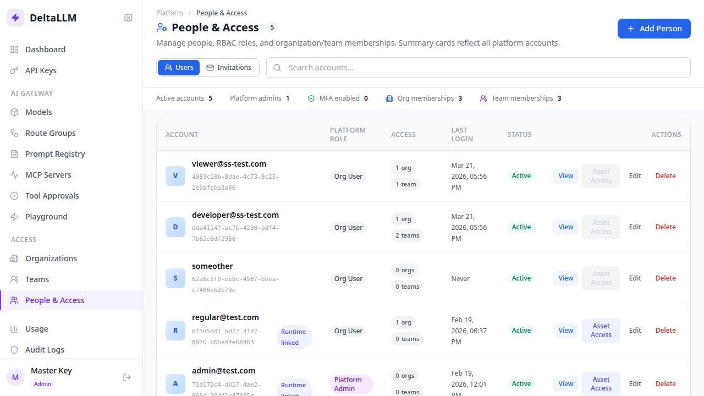

# People & Access

People & Access is the RBAC and onboarding control surface for platform accounts, invitations, and memberships.

## What this page manages

- Platform accounts
- Pending invitations
- Platform roles such as `platform_admin` and `org_user`
- Organization memberships
- Team memberships
- Runtime user asset access for scoped governance

## How the page works

- The top list shows platform accounts and their current role
- The invitation panel lets admins invite by email, resend pending invitations, and cancel them
- Expanding an account reveals its organization and team memberships
- Modals let admins add accounts, attach memberships, or edit runtime user asset access without leaving the page

## Invitations

People & Access is the main invite-by-email surface.

Use it to:

- invite a new email address into an organization or team
- resend an invite if the user did not receive it
- cancel an invite before it is accepted

Organization and team detail pages deep-link back into this page for invitation workflows.

## Recommended onboarding flow

1. Invite the user from People & Access
2. Let the user accept the invite from their email link
3. If the user has no auth method yet, they set a password during acceptance
4. If the user is SSO-only, they can accept without creating a local password
5. If the user already has MFA enabled, they accept access first and then complete a normal login flow

## Recommended model

- Use **platform role** for top-level authority
- Use **organization membership** for tenant scope
- Use **team membership** for the most specific working access
- Use **runtime user asset access** only when a specific user must be narrower than the inherited team and organization asset set

This keeps the access model explicit and traceable.
