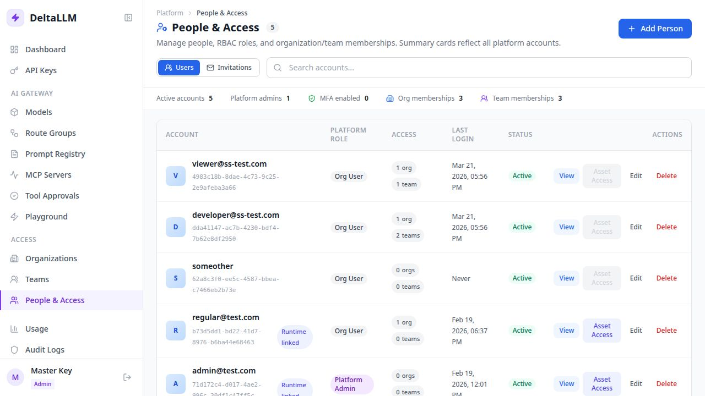

# People & Access

People & Access is the RBAC and onboarding control surface for platform accounts, invitations, and memberships.

## What this page manages

- Platform accounts
- Pending invitations
- Platform roles such as `platform_admin` and `org_user`
- Organization memberships
- Team memberships
- Runtime user asset access for scoped governance

## How the page works

- The top list shows platform accounts and their current role
- The invitation panel lets admins invite by email, resend pending invitations, and cancel them
- Expanding an account reveals its organization and team memberships
- Self-registered sandbox users are marked with a sandbox access badge
- Runtime user budgets, rate limits, and self-service key policy are visible from the account details drawer
- Modals let admins add accounts, attach memberships, or edit runtime user asset access without leaving the page

## Invitations

People & Access is the main invite-by-email surface.

Use it to:

- invite a new email address into an organization or team
- resend an invite if the user did not receive it
- cancel an invite before it is accepted

Organization and team detail pages deep-link back into this page for invitation workflows.

## Recommended onboarding flow

1. Invite the user from People & Access
2. Let the user accept the invite from their email link
3. If the user has no auth method yet, they set a password during acceptance
4. If the user is SSO-only, they can accept without creating a local password
5. If the user already has MFA enabled, they accept access first and then complete a normal login flow

## Self-Registered Sandbox Users

If `general_settings.self_registration` is enabled for SSO, eligible first-time SSO users appear in People & Access after their first successful sign-in. Their account details show the seeded organization membership, team membership, runtime user limits, and the default team's self-service key policy.

The badge is informational. Admins can still edit the account, add or remove memberships, adjust runtime user asset access, and update the seeded organization/team records from their detail pages.

## Promoting a Sandbox User

To move a developer from sandbox access to production access:

1. Open the user in People & Access and confirm the account identity.
2. Add the production organization or team membership with the correct role.
3. Remove the sandbox team membership if the user should no longer create sandbox keys.
4. Adjust runtime user limits or asset access if the production team requires different guardrails.
5. Review API Keys and revoke any sandbox keys that should not remain active.

## Recommended model

- Use **platform role** for top-level authority
- Use **organization membership** for tenant scope
- Use **team membership** for the most specific working access
- Use **runtime user asset access** only when a specific user must be narrower than the inherited team and organization asset set

This keeps the access model explicit and traceable.
