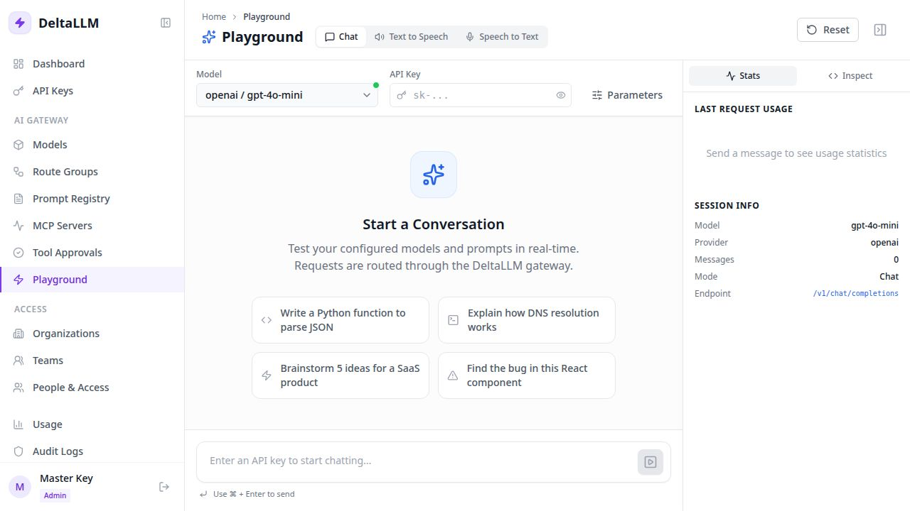

# Playground

The Playground sends real data-plane requests through DeltaLLM using an API key you provide. Use it
to validate a configured model, routing, key scope, and request parameters before integrating an
application.

## Access and prerequisites

- Any authenticated Admin UI account can open **Playground**.
- Execution requires a DeltaLLM API key; the browser session is not substituted for gateway auth.
- The key must be allowed to call the selected public model/route target and remain within its
  budget and rate limits.
- At least one deployment with the relevant workload mode must exist. The selector groups chat,
  text-to-speech (`audio_speech`), and speech-to-text (`audio_transcription`) deployments.

Do not paste a production application's credential into an untrusted browser or shared screen.
Create a short-lived, narrowly scoped test key when possible.

## Chat

1. Select **Chat**, a healthy chat/completion deployment, and enter the test API key.
2. Open **Parameters** to set the system prompt, temperature, maximum tokens, top-p, and penalties.
3. Send a message. The response streams through `/v1/chat/completions`.
4. Open **Stats** for token counts and latency; open **Inspect** for the request shape and a curl example.
5. Use **Stop** to abort generation or **Reset** to clear the local conversation.

Success means a streamed response finishes, Stats identifies the selected public model, and the
request appears under [Usage & Spend](usage.md) for the key's authorized scope.

## Text to speech

1. Select **Text to Speech** and an `audio_speech` deployment.
2. Enter text, choose an available voice, speed, and output format, then generate.
3. Play or download the returned audio.

Success means the browser receives playable audio from `/v1/audio/speech` and reports request
latency/file size. An empty model selector means no compatible deployment is configured.

## Speech to text

1. Select **Speech to Text** and an `audio_transcription` deployment.
2. Upload an audio file up to 25 MB or record from the browser after granting microphone access.
3. Optionally set language, response format, and prompt; then transcribe.

Success means `/v1/audio/transcriptions` returns text and the Playground shows word count and
latency. Browser recording requires a secure context in normal production browsers.

## Troubleshooting

| Symptom | Check |
| --- | --- |
| Page visible but Send/Generate is disabled | Enter an API key and select a compatible deployment |
| No models for one mode | Create a deployment with the matching `model_info.mode` |
| `401` or `403` | Key validity, expiry, owner scope, and callable-target access |
| `429` | Key/team/org/tier limits or budget and the response rate-limit headers |
| Provider error | Deployment health, provider credential, upstream model ID, and fallback events |
| Microphone unavailable | Browser permission, secure origin, device policy, and supported recording format |

See [Models](models.md), [API keys](api-keys.md), and the [proxy endpoint reference](../api/proxy.md).
