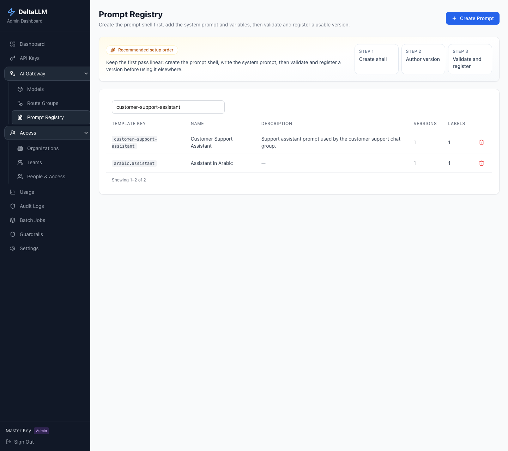
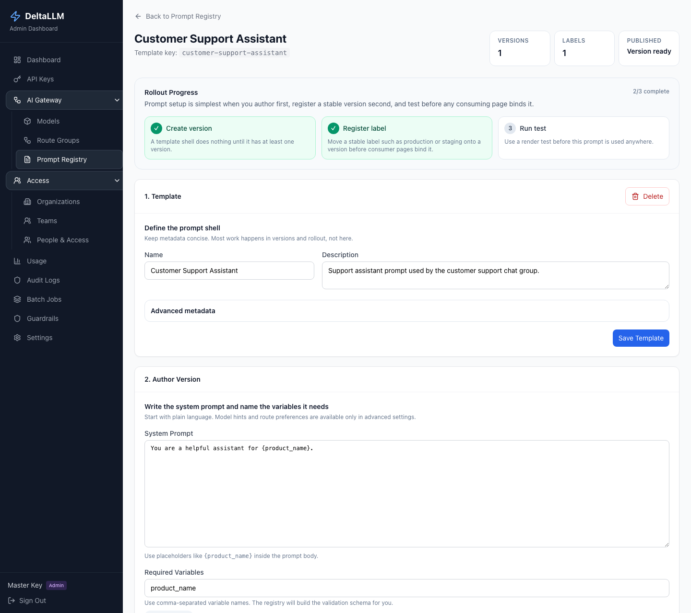

# Prompt Registry

Prompt Registry manages prompts as first-class versioned assets.

## Recommended flow

1. Create the prompt shell
2. Write the system prompt
3. Declare the required variables
4. Register a stable label such as `production`
5. Run a render test before rollout

The detail page is intentionally structured in that order.

## What the registry owns

- Prompt identity (`template_key`)
- Immutable prompt versions
- Stable labels that move between versions
- Render validation and history

## What the registry does not own

Prompt binding belongs to the consuming surface.

For example, a route group binds a prompt from the [Route Groups](route-groups.md) page rather than from the prompt detail page. This keeps ownership clear:

- **Prompt Registry** defines what the prompt is
- **Route Groups** decide where it applies

## Versioning and testing

- Versions are immutable once created
- Labels provide a stable reference for rollout
- Dry-run render validates the required variables and shows the resolved prompt body
- History is the place to review older versions and compare changes
