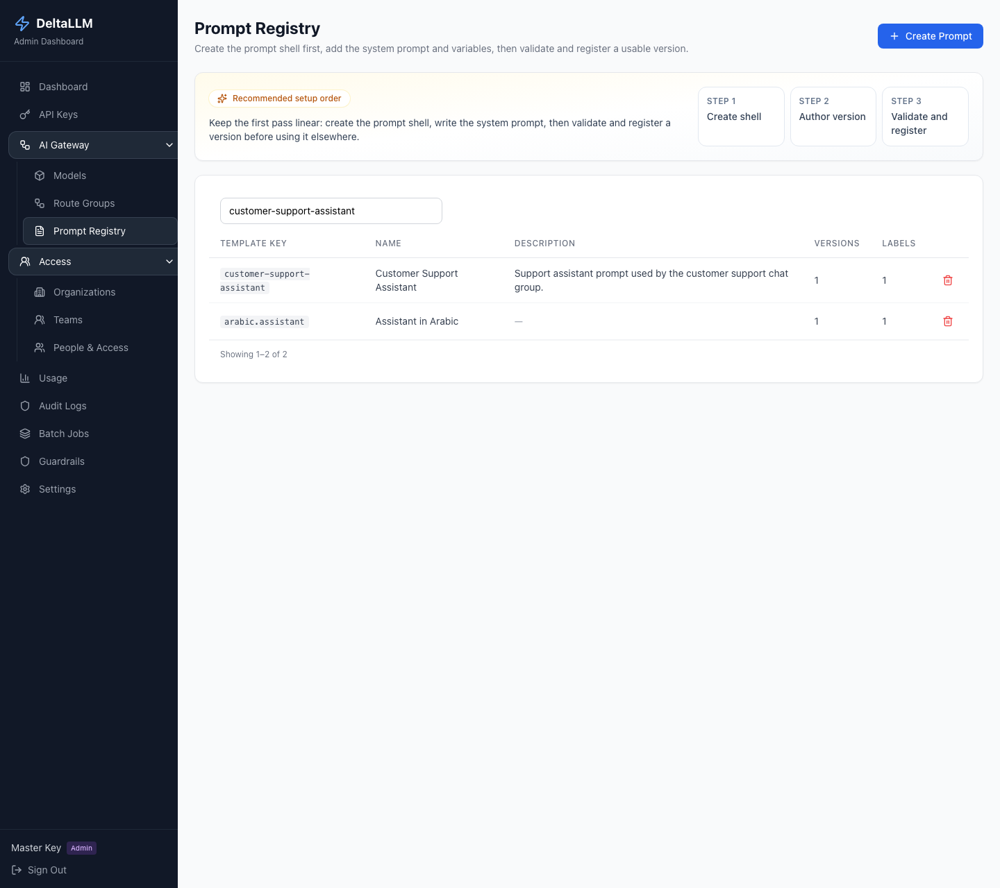
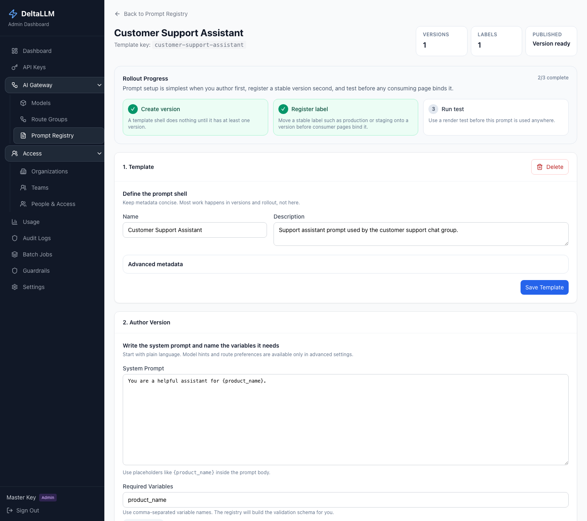

# Prompt Registry

Prompt Registry manages prompts as versioned runtime assets.

Use it when you want prompts to be treated like managed configuration instead of hardcoded strings in applications.

**Access:** platform admin. Templates, versions, labels, tests, and bindings are control-plane
configuration. See [Access requirements](access-requirements.md) and the [Prompt Registry admin
API](../api/admin.md#prompt-registry).

## List controls

Models, Model Groups, and Prompt Registry use the same list controls.
Select a column heading or use **Sort list** to change the order.
The server sorts all permitted results before it selects a page.
The initial order is **Updated at**, newest first. Search resets the page.

**Created by** shows the creator account ID, including platform administrator IDs.
Select the copy control to copy the full ID. The list does not show creator email addresses.
**Updated at** shows the stored update time in your local time zone.
If an old record has no creator ID or update time, the cell shows **Not recorded**.
**Visibility** is the last column. On small screens, each row becomes a card with the same fields.

You can sort by name, version count, label count, binding count, creator ID, update time, or visibility.
Counts come from the stored template records.

## Quick Success Workflow

1. Create a prompt template
2. Add the first version of the template body
3. Define the variables it expects
4. Publish or label the version you want to use
5. Bind that prompt from a consuming surface such as a route group

## What the Registry Owns

The registry owns:

- prompt identity through `template_key`
- immutable prompt versions
- stable labels such as `production`
- render and resolution testing
- binding records at supported scopes

## What the Registry Does Not Own

The registry defines the prompt itself, but it does not decide live traffic on its own.

In practice:

- Prompt Registry defines the prompt
- Route Groups or other supported scopes decide where it applies

## Why Versions and Labels Both Exist

- a version is immutable and good for review
- a label is movable and good for rollout

This gives operators a stable promotion flow:

1. create a new version
2. test it
3. move a label such as `production`
4. let the bound consumer resolve the new labeled version

## Validation and Safety

The prompt registry validates template keys and rejects secret-like content in template bodies before they are saved.

It also supports:

- render previews
- resolution previews
- binding inspection

## Related API Surface

The backend exposes endpoints for:

- templates
- versions
- labels
- bindings
- render preview
- resolution preview

See [Admin Endpoints](../api/admin.md) for the prompt-registry API reference.

## Related Pages

- [Route Groups](route-groups.md)
- [Admin API reference](../api/admin.md)
