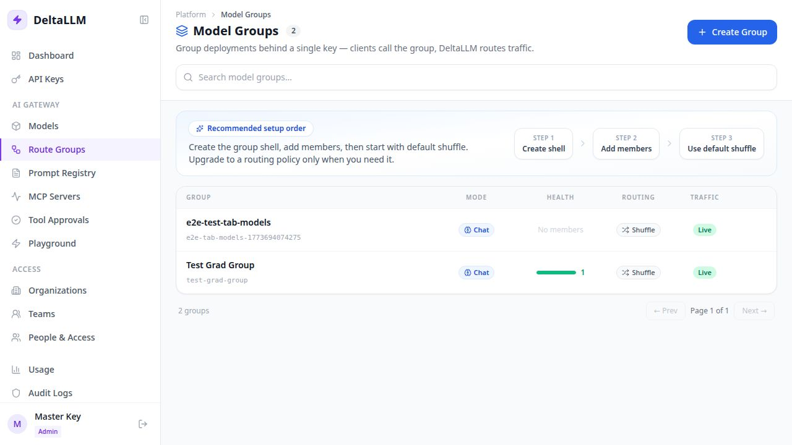
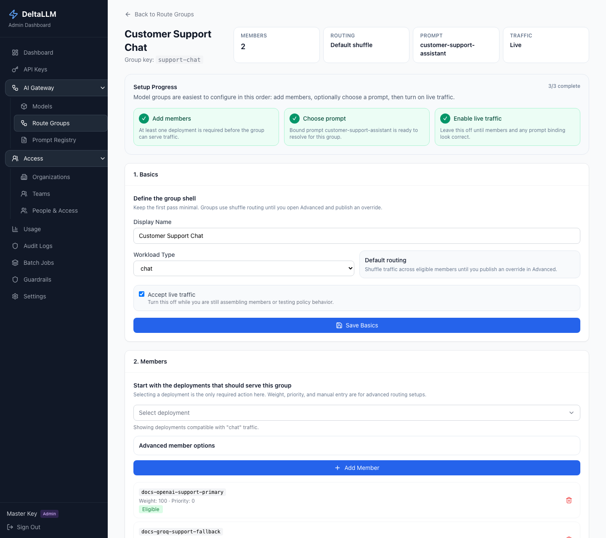

# Route Groups

Route Groups let you place multiple deployments behind one stable runtime target.

Use a route group when one public model name should:

- balance across several deployments
- fail over in a controlled way
- carry its own routing policy
- bind to a prompt at the group level

## Quick Success Workflow

1. Create the route group shell
2. Add one or more member deployments
3. Keep the default routing behavior at first
4. Mark the group live
5. Use the generated call example to test traffic

For most teams, this is the right first path. You do not need an advanced policy on day one.

## What the Group Owns

A route group defines:

- a stable group key
- the workload type, such as chat or embeddings
- which deployments are members
- whether the group is live
- optional prompt binding
- optional routing policy history and overrides

## What the List Page Shows

- group key and display name
- workload type
- whether the group is live
- member count
- current routing state

## What the Detail Page Lets You Do

- edit the basic group metadata
- add and remove member deployments
- see the current usage example for calling the group
- bind a prompt
- inspect and publish routing policy changes

## When You Need an Advanced Policy

Start with the default behavior unless you need one of these:

- ordered failover
- weighted traffic splits
- a specific routing strategy
- a draft, publish, rollback, or simulation workflow for routing changes

## Prompt Binding

Prompt binding belongs on the route group because the group decides where a prompt is applied.

That means:

- Prompt Registry defines the prompt template and its versions
- Route Groups decide which prompt is active for live traffic

If a prompt is bound, the usage example on the page should include the variables needed to call it correctly.

## Related API Surface

The backend exposes route-group endpoints for:

- listing and editing groups
- managing group members
- reading and publishing routing policy
- validating and simulating policy changes

See [Admin Endpoints](../api/admin.md) for the route-group API reference.

## Related Pages

- [Models](models.md)
- [Prompt Registry](prompt-registry.md)
- [Routing & Failover](../features/routing.md)
