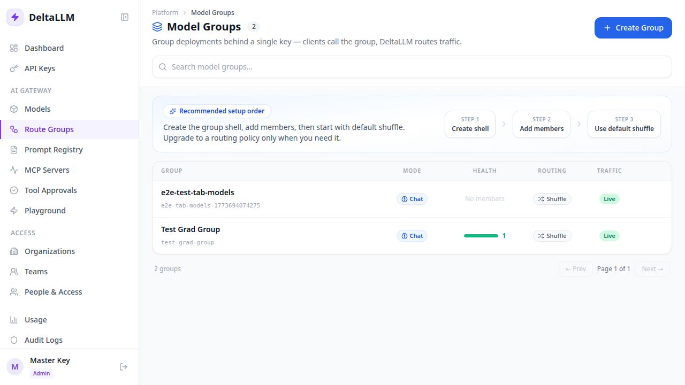
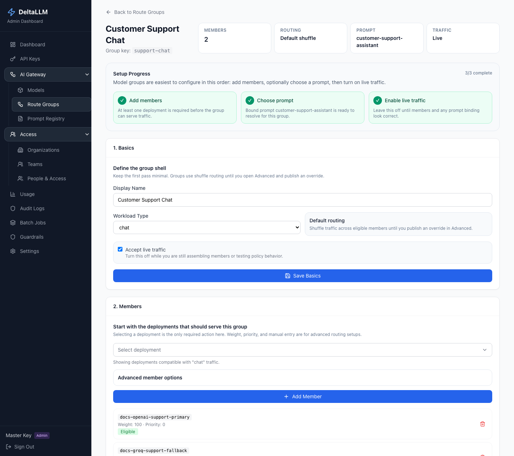

# Route Groups

Route Groups let you place multiple deployments behind one stable runtime target.

Use a route group when one public model name should:

- balance across several deployments
- fail over in a controlled way
- carry its own routing policy
- bind to a prompt at the group level





**Access:** platform admin for group, membership, policy, publication, simulation, and prompt-binding
operations. See [Access requirements](access-requirements.md), the [route-group API](../api/admin.md#route-groups),
and [Routing and Failover](../features/routing.md).

## Quick Success Workflow

1. Create the route group shell
2. Add one or more member deployments
3. Keep the default routing behavior at first
4. Mark the group live
5. Use the generated call example to test traffic

For most teams, this is the right first path. You do not need an advanced policy on day one.

## What the Group Owns

A route group defines:

- a stable group key
- the workload type, such as chat or embeddings
- which deployments are members
- whether the group is live
- optional prompt binding
- optional routing policy history and overrides

Route groups are also callable targets. Their runtime visibility is governed through the same callable-target bindings and scope policies used for public model names.

An enabled route group owns its group key. If a legacy model name uses the same key, the route group
takes precedence even when it has no active members; requests then receive a no-healthy-deployment
response instead of bypassing the group policy. Disable or delete the route group to expose the
same-named legacy model again.

Deleting a route group normally removes its callable-target bindings in the same transaction. If a
same-named model deployment exists, those bindings are retained so the newly revealed model keeps
the established authorization boundary.

All enabled members must match the group's workload type. A chat request cannot use an embeddings
group, including through fallback, and incompatible requests are rejected before provider-health or
capacity state is read.

## What the List Page Shows

- group key and display name
- workload type
- whether the group is live
- member count
- current routing state

## What the Detail Page Lets You Do

- edit the basic group metadata
- add and remove member deployments
- see the current usage example for calling the group
- bind a prompt
- inspect and publish routing policy changes

## When You Need an Advanced Policy

Start with the default behavior unless you need one of these:

- ordered failover
- weighted traffic splits
- a specific routing strategy
- a draft, publish, rollback, or simulation workflow for routing changes

## Routing Policy Basics

A route-group policy should stay small and explicit.

In practice, that means:

- choose one routing strategy
- optionally override member `enabled`, `weight`, or `priority`
- optionally override the group timeout
- optionally override retry behavior

The supported policy fields today are:

- `mode` (deprecated input alias only)
- `strategy`
- `members`
- `timeouts.global_ms` or `timeouts.global_seconds`
- `retry.max_attempts`
- `retry.retryable_error_classes`

The route group's workload type and the legacy policy `mode` field are different concepts. The
workload type identifies the compatible gateway endpoint. `strategy` is the canonical routing
field; old policy modes are accepted only as migration input and are omitted from normalized writes.

`retry.max_attempts` is the maximum number of additional same-deployment retries for the
whole routed request. The budget is shared across all primary and fallback candidates; it
is not reset for each candidate. Candidate failover attempts remain separate from retries.

## Legacy Policy Mode Aliases

Older clients may send these aliases:

- `weighted`: use weighted traffic splitting
- `fallback`: use ordered primary and standby behavior

How compatibility behaves:

- `weighted` maps to the `weighted` strategy if you do not set a strategy explicitly
- `fallback` maps to `priority-based-routing` if you do not set a strategy explicitly
- an explicit `strategy` remains authoritative when both fields are present
- validation returns a deprecation warning and normalized writes contain only `strategy`

The guided UI selects the concrete strategy directly and does not expose a separate policy-mode
control. Existing stored versions are not rewritten.

Do not plan around these as live runtime modes yet:

- `conditional`
- `adaptive`

Those are not active route-policy behaviors in the runtime today.

## Which Policy Should I Use?

Choose by goal:

- use `simple-shuffle` when the deployments are roughly equal
- use `weighted` when you want a controlled traffic split
- use `priority-based-routing` when one deployment should be primary
- use `least-busy` when you are smoothing burst traffic
- use `latency-based-routing` when end-user latency matters most
- use `cost-based-routing` when cost matters most
- use `rate-limit-aware` when provider limits are the problem

For most teams, one of these three is enough:

- `simple-shuffle`
- `weighted`
- `priority-based-routing`

## Simple Policy Examples

Weighted rollout:

```json
{
  "strategy": "weighted",
  "members": [
    {"deployment_id": "dep-primary", "weight": 9},
    {"deployment_id": "dep-canary", "weight": 1}
  ]
}
```

Primary plus standby:

```json
{
  "strategy": "priority-based-routing",
  "members": [
    {"deployment_id": "dep-primary", "priority": 0},
    {"deployment_id": "dep-standby", "priority": 1}
  ]
}
```

Latency-sensitive route group:

```json
{
  "strategy": "latency-based-routing",
  "timeouts": {"global_seconds": 45},
  "retry": {"max_attempts": 1}
}
```

Quota-aware route group:

```json
{
  "strategy": "rate-limit-aware"
}
```

## Member Overrides

Member overrides let the group behave differently without editing the underlying deployment definition.

- `enabled`: take a member out of rotation without removing it
- `weight`: change traffic share for `weighted`
- `priority`: control order for `priority-based-routing`

If a policy omits `members`, it inherits the group's enabled membership. Newly saved policies treat
an explicit `members` list as authoritative: members not listed are excluded rather than silently
added back. Existing policy versions retain their legacy interpretation so upgrades and historical
rollbacks do not silently change behavior. A policy may disable a member but cannot reactivate a
group member disabled by an operator. Duplicate or unknown member IDs and policies with no active
members are rejected.

Policy history shows a semantics version separately from the policy version. The policy version is
the group's publication sequence; the semantics version identifies how the runtime interprets the
document, including historical versions restored through rollback.

## Publication and Reload

Draft publication and rollback are serialized per route group. Version allocation, archival of the
previous publication, and activation of the replacement occur in one PostgreSQL transaction, and
the database permits at most one published version per group. Rollback creates a new version and
does not rewrite history. Publication and rollback revalidate the stored document against the
current enabled membership and workload mode; stale versions return `409` without changing the
published policy.

After commit, each replica invalidates its local snapshot and rebuilds a complete runtime generation
from durable state before swapping it live. A local reload or cross-replica notification failure is
reported as a post-commit warning; it does not mean that the already committed group, member, or
policy mutation was rolled back. Redis notifications accelerate this process, while a PostgreSQL
runtime revision poll reconciles missed notifications within 30 seconds by default. Re-read durable
state before retrying a mutation.
The Admin UI displays these warnings on create, update, delete, member, publish, and rollback
results instead of reporting an unconditional success.

## Good Operating Pattern

Use this workflow:

1. Create the route group and add members
2. Start with `simple-shuffle` or `weighted`
3. Simulate before publishing policy changes
4. Publish only after the selection summary looks right
5. Check `/health/deployments` and `/health/fallback-events` after rollout

The simulation view is especially useful for:

- checking weighted splits
- confirming fallback order
- confirming prompt-derived tag routing
- testing retries and fallback under assumed timeout, rate-limit, or unavailable outcomes

## Policy Simulation

Open **Advanced → Policy Simulation** to dry-run the policy currently shown in the guided or JSON
editor. The simulation can use request tags and a per-deployment assumed outcome. A successful
outcome is the default; failure outcomes pass through the same retry classification, retry budget,
candidate ordering, and fallback decisions used by gateway requests.

The policy shown in the editor is simulated as a complete replacement, matching validation and
publication semantics. Clearing retry or timeout controls removes those overrides, and choosing
**Inherit enabled** uses the route group's enabled membership rather than retaining the published
policy's prior explicit subset.

The results distinguish:

- the initially selected deployment
- the deployment that ultimately served each request
- requests that required fallback
- terminal success, timeout, rate-limit, unavailable, or no-selection outcomes
- a bounded sample trace of primary, retry, and fallback attempts
- eligibility decision reasons from the router

This is a control-plane dry run. It pins one routing-runtime generation, snapshots the required
health, cooldown, active-request, usage, and latency state once, and performs all attempt accounting
locally. It does not call a provider, wait for configured retry backoff, emit operational fallback
events, or mutate live health, cooldown, usage, latency, or concurrency state. The result therefore
answers “what would this policy do against this captured state and these assumed outcomes?”; it is
not a provider availability forecast.

Editing the policy, request tags, iteration count, or assumed outcomes marks the last result stale.
Starting a new simulation cancels the prior UI request, and an older completion cannot replace a
newer result. A failed refresh leaves the last successful result visible with its stale/error state.
Route-group administration permission is required.

## Prompt Binding

Prompt binding belongs on the route group because the group decides where a prompt is applied.

That means:

- Prompt Registry defines the prompt template and its versions
- Route Groups decide which prompt is active for live traffic

If a prompt is bound, the usage example on the page should include the variables needed to call it correctly.

## Related API Surface

The backend exposes route-group endpoints for:

- listing and editing groups
- managing group members
- reading and publishing routing policy
- validating and simulating policy changes

See [Admin Endpoints](../api/admin.md) for the route-group API reference.

## Related Pages

- [Models](models.md)
- [Prompt Registry](prompt-registry.md)
- [Routing & Failover](../features/routing.md)
