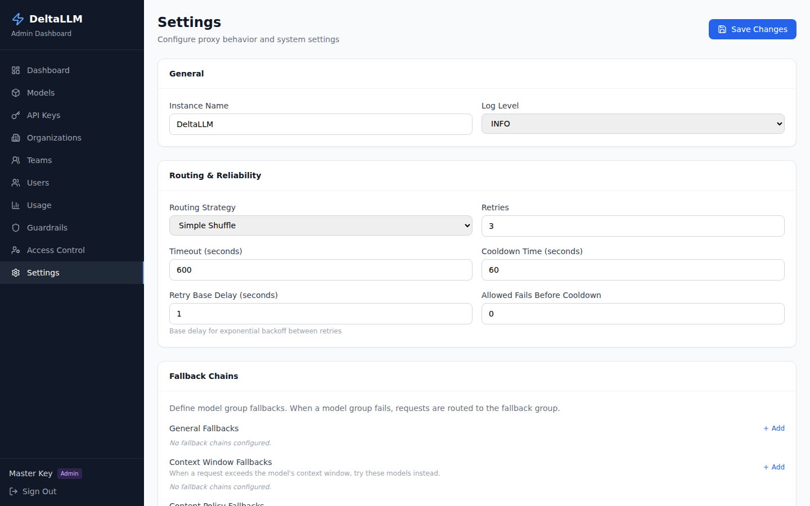

# Settings

Settings control the global runtime behavior of the gateway.

**Access:** platform admin or master-key break-glass session. Changes are installation-wide. See
[Access requirements](access-requirements.md), the [settings API](../api/admin.md#settings-and-routing-config),
and [General Settings](../configuration/general.md).

## Main sections

- **General**: runtime log level
- **Theme**: instance name, simple and expanded logos, favicon, primary and secondary action colours, and menu hover colour
- **Routing & Reliability**: default strategy, retries, timeouts, and cooldowns
- **Fallback Chains**: explicit fallback mappings
- **Recent Fallback Events**: operational fallback review
- **Caching**: cache enablement, backend, and TTL
- **Health Checks**: background probe behavior

## When to use this page

Use Settings for platform-wide defaults. Do not use it for per-group routing behavior; that belongs in [Route Groups](route-groups.md).

The Theme tab is available only to platform administrators (and the master-key break-glass session). Changes include an in-page preview. After a successful save, the browser applies the committed server response and healthy replicas converge through the configuration propagation path. **Discard changes** only restores the last saved name and colours in the current form; it does not modify the database or uploaded assets.

**Reset to DeltaLLM defaults** is a separate installation-wide action. After confirmation, the server writes the factory name and colours and permanently deletes the uploaded simple logo, expanded logo, and favicon bytes in one database transaction. A successful response means that transaction committed; the browser updates from the committed response. If the response reports that reconciliation is pending, the reset is still durable and the responding process will recover from the database. Healthy replicas normally receive a Redis wake-up and also poll PostgreSQL every 30 seconds by default. A rejected reset leaves the current theme intact so it can be retried. The reset cannot be undone from the Settings page, and reverting application code does not restore deleted asset bytes.

Simple logos, expanded logos, and favicons are uploaded directly as PNG, JPEG, WebP, SVG, or ICO files up to 2 MB (ICO is favicon-only). Uploaded files are validated, stored as database BLOBs, and cached in memory by every replica. After a successful **Replace** or **Remove** request, the browser applies the saved result and replicas converge through the same propagation path. Button and branded-text foregrounds, surfaces, and hover colours are derived automatically to preserve visible, accessible controls. If a wordmark, mark, or favicon fails to load, the UI retries or falls back to the next safe built-in presentation. See [General Settings](../configuration/general.md#ui-branding) for persistence and replica behavior.

Authentication and onboarding controls such as SSO, invitations, and self-registration sandbox defaults are configured in `general_settings`, not from this page. See [General Settings](../configuration/general.md#self-registration-settings) and [Authentication & SSO](../features/authentication.md#self-service-sandbox-registration) for the self-registration sandbox flow.

## Good operating pattern

- Keep global defaults conservative
- Use route groups for workload-specific routing
- Use this page only for shared runtime behavior that should apply across the gateway
