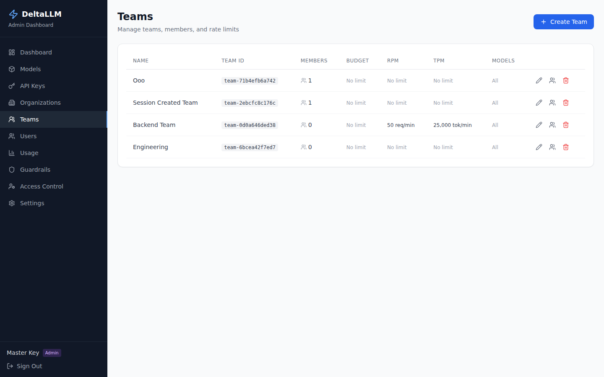

# Teams

Teams are the working unit for developers, applications, keys, and team-level budgets.

## What this page manages

- Team identity and parent organization
- Team-level budgets and rate limits (RPM, TPM, RPH, RPD, TPD)
- Team memberships
- Team runtime access mode: inherit the organization set or restrict to selected callable targets

## Typical workflow

1. Create the team inside an organization
2. Confirm the self-service key policy for developers
3. Set team-specific budgets and rate limits across all time windows
4. Add team members with the correct role
5. Choose whether the team inherits the organization asset set or narrows it to selected assets

## Rate limit fields

| Field | Description |
| --- | --- |
| RPM | Maximum requests per minute across all keys in the team |
| TPM | Maximum tokens per minute across all keys in the team |
| RPH | Maximum requests per hour across all keys in the team |
| RPD | Maximum requests per day across all keys in the team |
| TPD | Maximum tokens per day across all keys in the team |

All limits are optional. Only configured limits are enforced. Team limits act as a shared cap — all keys within the team contribute to the same counters. Team limits must fall within the parent organization's limits.

## Self-Service Key Policy

Teams can allow their developers to create their own API keys without admin involvement. New teams start with self-service enabled by default in the create form, and you can review or tighten the policy later in the Team Detail page under the **Self-Service Keys** card (visible to team admins and above).

### Policy fields

| Field | Description |
| --- | --- |
| Enabled | Whether self-service key creation is allowed for this team |
| Max keys per user | How many active keys each developer can hold at once |
| Budget ceiling | Maximum budget a self-service key can be assigned |
| Require expiry | Whether every self-service key must have an expiration date |
| Max expiry days | Longest allowed key lifetime in days |

When a developer creates a key through self-service, the backend enforces all of these constraints and rejects requests that violate any of them. See [API Keys: Self-Service Key Creation](api-keys.md#self-service-key-creation) for the full list of enforced constraints.

### Enabling self-service

1. Create a new team or open an existing team detail page
2. Leave **Allow developers to create personal API keys** enabled, or turn it on in the **Self-Service Keys** card
3. Set optional constraint fields only if the team needs tighter guardrails
4. Save — developers with `team_developer` role can now create keys

## Why this matters

Team scope is where most day-to-day ownership lives. API keys, usage, and user access are typically understood in team context.

The team record itself no longer stores model allowlists. The create/edit UI writes callable-target bindings and scope policies so the team can inherit the organization set or narrow it for day-to-day ownership.
