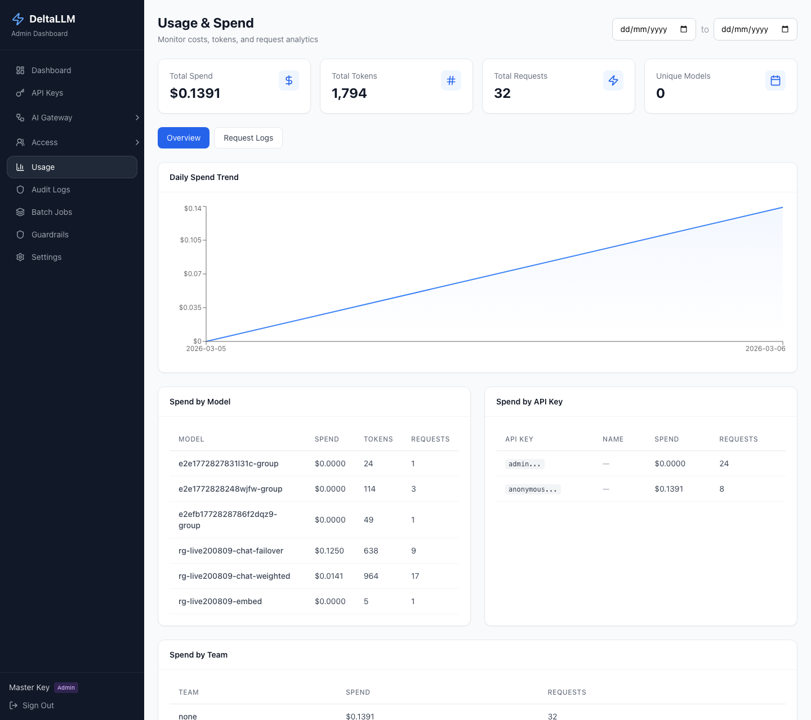

# Usage & Spend

Usage & Spend is the analytics surface for requests, tokens, and cost.

## What this page provides

- Date-range filtering
- Top-level spend and request totals
- Daily spend trend
- Breakdown by model, key, and team
- Request-log view for operational inspection

## Two main modes

- **Overview**: charts and spend breakdown tables
- **Request Logs**: recent request-level cost and token entries

## When to use it

Use this page for cost review, tenant reporting, and identifying which models or keys are driving traffic.
