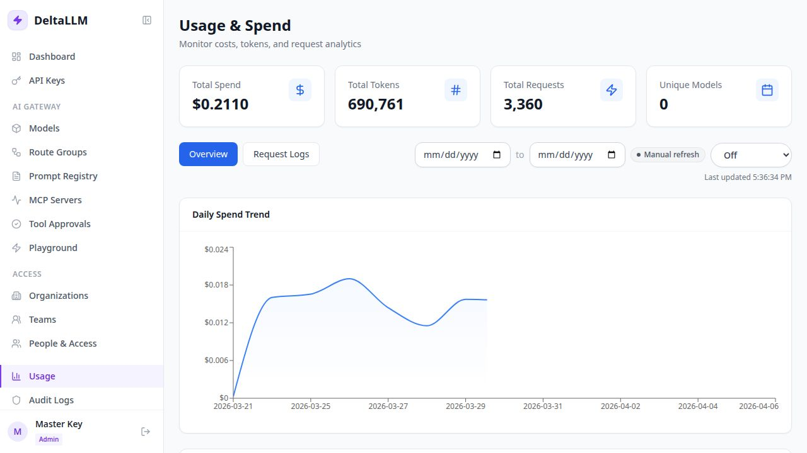

# Usage & Spend

Usage & Spend is the analytics surface for requests, tokens, and cost.

**Access:** platform admin or an enabled spend-read permission. The server selects platform,
organization, team, or self scope before returning data. See [Access requirements](access-requirements.md),
the [Spend API](../api/admin.md#spend), and [Budgets and Spend](../features/budgets.md).

## What this page provides

- Date-range filtering
- Top-level spend and request totals
- Daily spend trend
- Breakdown by model, key, and team
- Request-log view for operational inspection

## Access scope

The server filters every summary, trend, and breakdown before it reaches the browser:

- Organization owners, billing users, and auditors see usage for their authorized organizations.
- Team administrators see usage for teams they administer.
- Regular organization and team members see usage generated by API keys owned by their account.
- Platform administrators see platform-wide usage.

Users with more than one reporting role get a compact **View** selector. Organization, team, and personal reports stay separate so totals and rankings always describe one clear scope. Self-scoped users get a simplified **Your usage** view: they can partition only their own usage by organization or team, then inspect the selected row's model mix. Detailed request logs, user/API-key dimensions, and tenant-wide rankings remain limited to elevated reporting roles.

Self attribution uses the API key's trusted platform-account owner at request time, not caller-provided `user` or `end_user` values. It is also constrained to the account's current organization or team memberships. Shared-key traffic is therefore attributed to the recorded key owner without allowing former tenant members to retain visibility.

Organization and team breakdowns in **Your usage** retain this same owner-account predicate. Selecting a row narrows the personal report; it does not expose usage generated by other accounts in that organization or team.

Scoped team and personal reporting is protected by `general_settings.spend_reporting_v2_enabled`, which defaults to `false`. For a rolling deployment, first deploy the schema, ownership writers, and reporting API to every gateway and batch worker with the flag disabled. Verify the migration and fleet version, then enable the flag in a separate rollout. Organization and platform reporting remain available while the flag is disabled.

## Two main modes

- **Overview**: charts and spend breakdown tables
- **Request Logs**: recent request-level cost and token entries

## When to use it

Use this page for cost review, tenant reporting, and identifying which models or keys are driving traffic.

## Legacy attribution

New spend events and managed batch jobs snapshot their key owner's account automatically. Legacy rows without an owner snapshot remain unattributed and are intentionally excluded from self-scoped reports. DeltaLLM does not infer historical ownership from the key's current owner because keys may have been rotated, transferred, or deleted.

Unattributed organizations, teams, users, and models are displayed explicitly as unassigned or unspecified. This state is represented separately from the entity identifier, so a legitimate identifier or model named `__unassigned__` remains distinct and can be inspected normally.
